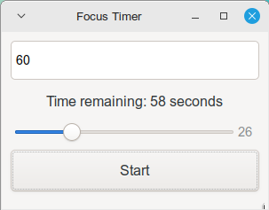

# Focus Timer

A simple GTK-based focus timer application with sound notification.



## Features
- Simple and clean GTK3 interface
- Customizable timer duration
- Audio notification when timer completes
- Automatic timer restart
- Time display in minutes:seconds format
- Volume control slider to adjust audio notification volume

## Dependencies

The Focus Timer application requires the following libraries:

- **GTK 3**: For the graphical user interface.
- **ALSA**: For audio playback.

## Installation

### Automatic Installation (Recommended)
To install the Focus Timer, run the following command:

./install.sh

- This script will:Install required dependencies and Compile the program.
- Testing Sound System
  The installation script includes a test for the sound system. Ensure that your audio is working correctly.

## Running the Application 
After installation, you can run the Focus Timer using:

./focus_timer

## Usage
Adjust the timer duration in seconds.
Use the volume control slider to set the desired notification volume.
Click "Start" to begin the timer.

## Cloning and Building

To clone and build the project, follow these steps:

1.  Clone the repository:
    ```bash
    git clone [repository URL]
    cd focus-timer
    ```
2.  Run the install script:
    ```bash
    ./install.sh
    ```
3.  Run the application:
    ```bash
    ./focus_timer
    ```

